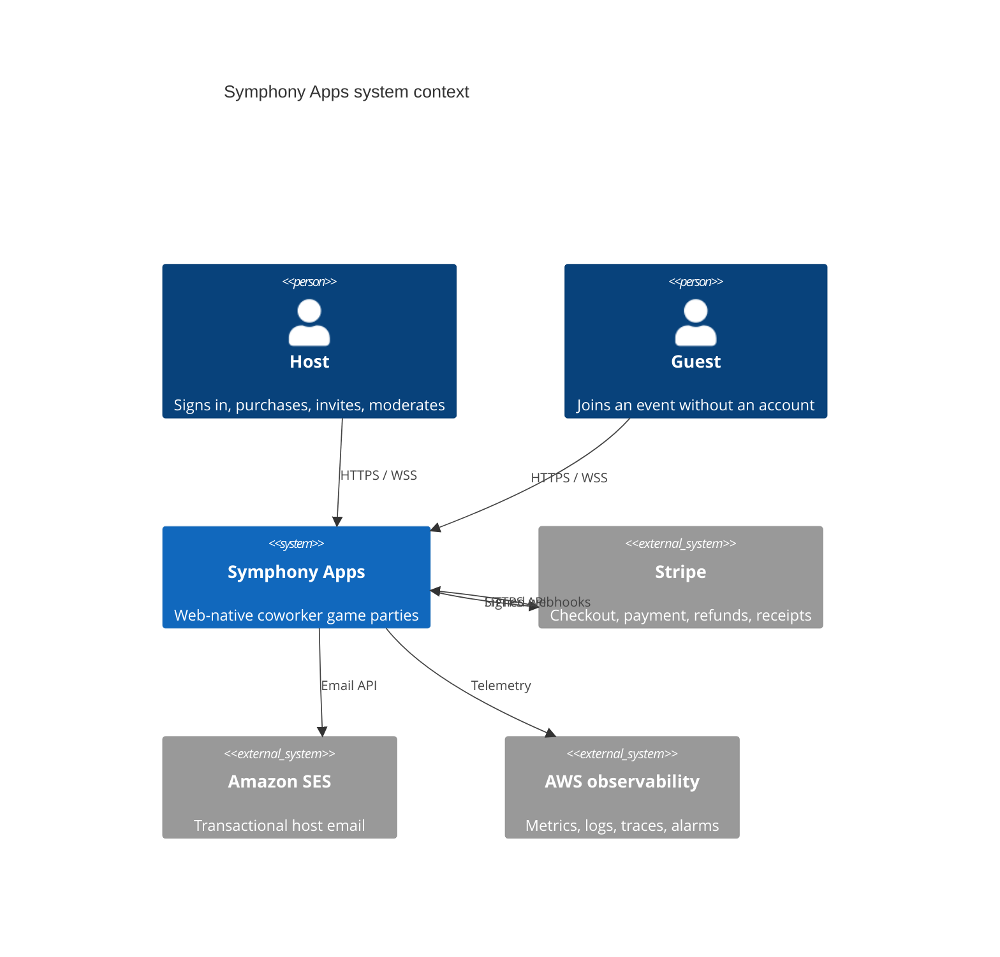
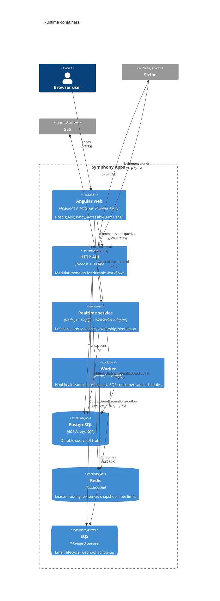
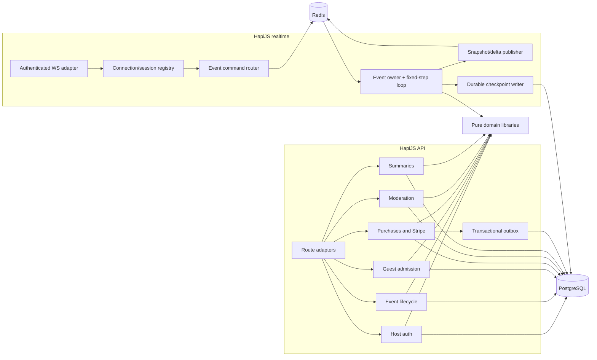
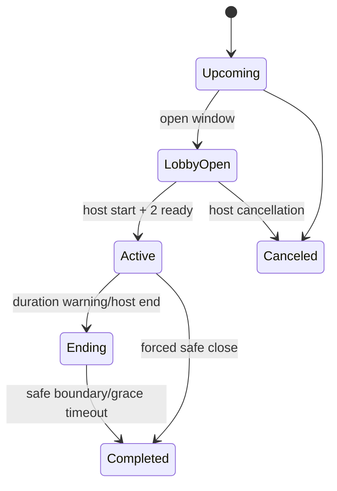
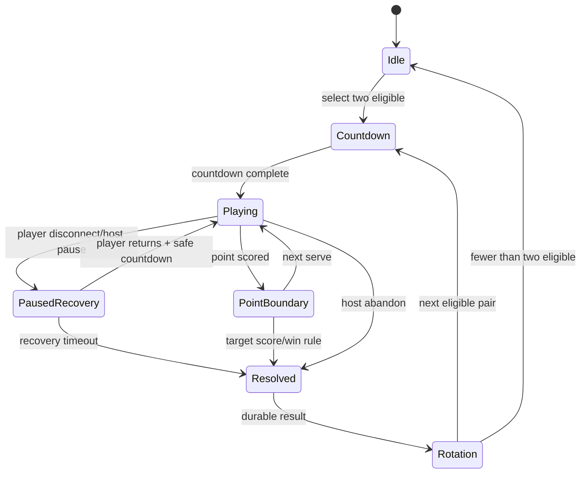
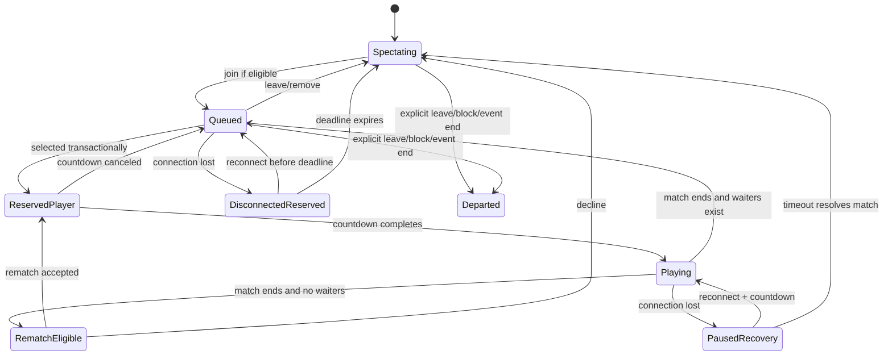
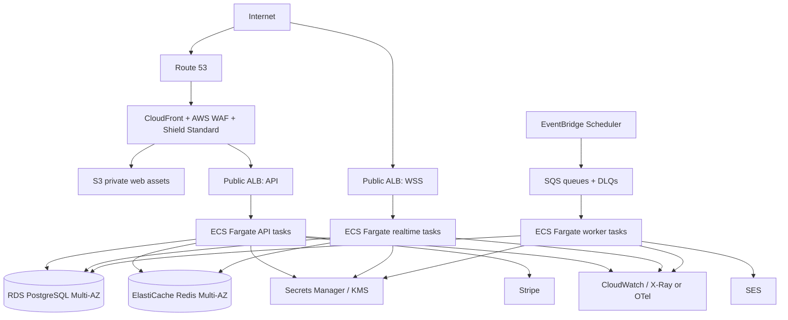

# Symphony Apps Architecture

**Status:** implementation baseline  
**Product contract:** `product/PRODUCT_REQUIREMENTS.md`  
**Scope:** practical MVP architecture with an explicit path to scale

## 1. Executive summary

Build one Nx monorepo containing:

- an Angular 19 web application, statically hosted from S3 through CloudFront;
- a HapiJS modular-monolith API for host identity, events, admission, payments, summaries, and administration;
- a separate HapiJS realtime service for WebSocket connections and authoritative tennis simulation;
- TypeScript AWS CDK applications for all cloud infrastructure;
- shared, framework-independent TypeScript domain and protocol libraries.

PostgreSQL owns every durable business fact. Redis is warranted because it provides low-latency party coordination, event-owner leases, cross-instance command routing, presence TTLs, and recoverable live snapshots. Redis never owns payment, entitlement, membership, queue, or completed-point facts by itself. Losing Redis can reset an in-progress rally, but not a purchased event, admitted identity, queue, match score, or event summary.

This is intentionally not a microservice estate. Transactional HTTP concerns stay in one deployable API with internal modules and one database. Realtime simulation is separate because its scaling model, connection lifetime, release risk, and fixed-step workload differ materially from ordinary request/response traffic.

## 2. Goals, assumptions, and non-goals

### 2.1 Architecture goals

1. Meet every feature-complete scenario in the product contract.
2. Make event isolation an authorization invariant, not a naming convention.
3. Keep purchase and identity operations retry-safe.
4. Keep game outcomes server-authoritative and domain logic deterministic.
5. Recover ordinary disconnects automatically and infrastructure failures to a documented safe point.
6. Ship quickly with few deployables while preserving clear extraction seams.
7. Meet WCAG 2.2 AA outside the canvas and expose essential canvas state in accessible DOM.
8. Scale parties horizontally without Kubernetes or per-party infrastructure.
9. Keep card data out of Symphony systems by using Stripe Checkout.
10. Make local tests fast and deterministic.

### 2.2 Assumptions

- One AWS account per environment initially: `dev`, `staging`, and `prod`; production may move to a dedicated account before launch.
- One AWS region initially, with Multi-AZ services. Cross-region active-active is not an MVP requirement.
- One active court per event, two players per match, and a purchased cap measured in concurrently admitted participants.
- Typical parties contain 4–50 people and last 30–120 minutes. Capacity tests must validate final commercial limits.
- Corporate browsers permit HTTPS and secure WebSockets on port 443. The UI detects and explains blocked WebSockets/storage.
- Email is host-only in MVP. Guests are identified only within an event.
- Existing meeting software supplies voice/video.
- Event timestamps are persisted as UTC instants plus the host-selected IANA time-zone identifier.

### 2.3 Explicit non-goals

- Kubernetes/EKS, service mesh, Lambda-per-command, event sourcing, CQRS read stores, or a separate database per party.
- Native applications, built-in conferencing, free-text chat, tournaments, rankings, organizations, subscriptions, SSO, or SCIM.
- Cross-region seamless live-game failover.
- Perfect continuation of ball position through process or Redis loss.
- Client-authoritative physics, peer-to-peer networking, or trust in client-reported scores.
- Durable storage of individual input frames, reactions, or rally trajectories.

## 3. Key decisions and tradeoffs

| Decision | Rationale and tradeoff |
|---|---|
| Nx integrated monorepo | Atomic protocol/domain changes, enforceable boundaries, shared tooling. CI must use affected builds and ownership rules to avoid a monorepo bottleneck. |
| Angular SPA on S3/CloudFront | Fast, inexpensive global delivery. No SSR initially: event pages are private and search indexing is not valuable. Add prerendering only for public marketing pages if needed. |
| HapiJS API modular monolith | One transaction boundary and one operational unit for tightly related MVP business workflows. Internal modules prevent accidental coupling and permit later extraction. |
| Separate HapiJS realtime service | WebSockets, fixed-step simulation, and long-lived connections need independent autoscaling and safe deploy/drain behavior. Hapi owns health, auth/bootstrap, lifecycle, and observability; a small WebSocket adapter attaches to its Node listener. |
| PostgreSQL as durable source of truth | Relational constraints and transactions fit purchases, identities, events, queue ordering, and deduplication. JSON is limited to immutable external payloads and versioned summaries. |
| Redis for live state and routing | Needed for low-latency multi-instance realtime. Adds cost and failure modes, controlled by PostgreSQL checkpoints and a rebuild path. |
| ECS Fargate behind ALBs | Long-lived WebSockets and continuously ticking games do not fit Lambda well. Fargate avoids cluster management and scales independently. EKS adds no MVP value. |
| At-least-once events plus idempotent consumers | SQS, Stripe, reconnects, and network retries naturally duplicate. Exactly-once delivery is not assumed. |
| Fixed-step authoritative simulation | Predictable outcomes and cheat resistance. Small input delay and interpolation are acceptable for relaxed tennis. |
| Opaque invitations; rotating signed rejoin credentials | Invitations must be revocable immediately; rejoin credentials need portable identity claims plus server-side revocation. No authorization relies only on unverifiable URL state. |

No narrow exception to the preferred product stack is required. PostgreSQL, Redis, and a minimal standards-based WebSocket adapter are infrastructure/protocol choices within that stack, not alternate application frameworks.

## 4. System context



## 5. Container view



The worker remains a small HapiJS server application so every Node deployable has consistent configuration, lifecycle hooks, health/readiness routes, authentication for operational endpoints, logging, and graceful shutdown. Its actual work is driven by SQS and scheduled EventBridge messages.

## 6. Backend component view



Transport-facing features parse input and call use-case functions. Side effects implemented with the AWS SDK, Hapi request/reply, SQL clients, Redis clients, clocks, randomness, mail, and Stripe live behind `data-access` libraries and are passed into features as dependencies. Models and pure utilities accept values and return values/events; they never import Hapi, Angular, AWS, Stripe, Redis, or database clients.

## 7. Nx workspace layout and boundaries

```text
/
├── apps/
│   ├── web/                               # thin Angular composition/bootstrap wrapper
│   ├── api/                               # thin HapiJS API composition wrapper
│   ├── realtime/                          # thin HapiJS + WebSocket composition wrapper
│   ├── worker/                            # thin worker composition wrapper
│   └── infrastructure/                    # thin AWS CDK composition wrapper
├── libs/
│   ├── frontend/
│   │   ├── feature/
│   │   │   ├── application-shell/
│   │   │   ├── host-dashboard/
│   │   │   ├── event-setup/
│   │   │   ├── party-lobby/
│   │   │   └── tennis-game/
│   │   ├── data-access/
│   │   │   ├── http-client/
│   │   │   └── realtime-client/
│   │   ├── util/
│   │   │   ├── pixi-renderer/
│   │   │   └── accessibility/
│   │   └── models/
│   │       └── view-state/
│   ├── backend/
│   │   ├── feature/
│   │   │   ├── auth-manager/
│   │   │   ├── event-manager/
│   │   │   ├── admission-manager/
│   │   │   ├── payment-manager/           # purchase and refund orchestration
│   │   │   ├── live-party-manager/
│   │   │   ├── http-api/
│   │   │   ├── realtime-server/
│   │   │   ├── worker-runtime/
│   │   │   └── cloud-infrastructure/
│   │   ├── data-access/
│   │   │   ├── postgres/
│   │   │   ├── redis/
│   │   │   ├── stripe-connector/          # Stripe SDK boundary only
│   │   │   ├── ses-connector/
│   │   │   ├── sqs-connector/
│   │   │   └── websocket-transport/
│   │   ├── util/
│   │   │   ├── hapi-core/
│   │   │   ├── tennis-simulation/
│   │   │   ├── idempotency/
│   │   │   └── observability/
│   │   └── models/
│   │       ├── identity/
│   │       ├── events/
│   │       ├── admission/
│   │       ├── payments/
│   │       ├── party/
│   │       └── tennis/
│   └── shared/
│       ├── models/
│       │   ├── http-contracts/             # Zod schemas and inferred types
│       │   ├── realtime-contracts/         # Zod protocol schemas
│       │   ├── integration-events/         # Zod outbox/SQS schemas
│       │   └── identifiers/
│       └── util/
│           ├── result/
│           ├── time/
│           └── testing/
├── tools/
├── migrations/
└── architecture/
```

Applications contain configuration, framework bootstrap, and dependency composition only. Business behavior belongs in libraries. A feature such as `backend/feature/payment-manager` orchestrates policy and use cases; a connector such as `backend/data-access/stripe-connector` isolates external I/O and does not contain payment policy.

### 7.1 Enforceable Nx tags

Every project has tags such as:

- `scope:frontend`, `scope:backend`, or `scope:shared`;
- `type:feature`, `type:data-access`, `type:util`, or `type:model`;
- `type:app` only for projects under `apps/`.

`@nx/enforce-module-boundaries` rules:

1. `scope:frontend` may depend only on `scope:frontend` and `scope:shared`.
2. `scope:backend` may depend only on `scope:backend` and `scope:shared`.
3. `scope:shared` may depend only on `scope:shared`; shared code never reaches into frontend or backend.
4. `type:feature` may depend on feature, data-access, util, and model libraries allowed by its scope.
5. `type:data-access` may depend only on util and model libraries allowed by its scope.
6. `type:util` may depend only on util and model libraries allowed by its scope.
7. `type:model` may depend only on model libraries allowed by its scope.
8. `type:app` may compose libraries for its runtime but contains no business rules or reusable implementation.
9. Libraries import only public entry points; deep imports are prohibited through package exports and ESLint.
10. Circular project dependencies are prohibited. CODEOWNERS requires architecture review for shared contracts, boundary rules, migrations, and CDK.

These rules are encoded in `@nx/enforce-module-boundaries` with both scope and type constraints. The type hierarchy prevents models and utilities from gaining infrastructure dependencies, while the scope hierarchy prevents browser/server coupling. Side-effect ports are defined in model libraries where they are pure TypeScript contracts; their concrete implementations live in data-access libraries and are supplied by app composition roots.

The root ESLint configuration must make the taxonomy executable. Every Nx project declares one `scope:*` tag and one `type:*` tag in `project.json`. Because Nx applies every matching dependency constraint, the scope and type rules intersect:

```js
{
  '@nx/enforce-module-boundaries': [
    'error',
    {
      allow: [],
      enforceBuildableLibDependency: true,
      depConstraints: [
        {
          sourceTag: 'scope:frontend',
          onlyDependOnLibsWithTags: ['scope:frontend', 'scope:shared'],
        },
        {
          sourceTag: 'scope:backend',
          onlyDependOnLibsWithTags: ['scope:backend', 'scope:shared'],
        },
        {
          sourceTag: 'scope:shared',
          onlyDependOnLibsWithTags: ['scope:shared'],
        },
        {
          sourceTag: 'type:app',
          onlyDependOnLibsWithTags: [
            'type:feature',
            'type:data-access',
            'type:util',
            'type:model',
          ],
        },
        {
          sourceTag: 'type:feature',
          onlyDependOnLibsWithTags: [
            'type:feature',
            'type:data-access',
            'type:util',
            'type:model',
          ],
        },
        {
          sourceTag: 'type:data-access',
          onlyDependOnLibsWithTags: ['type:util', 'type:model'],
        },
        {
          sourceTag: 'type:util',
          onlyDependOnLibsWithTags: ['type:util', 'type:model'],
        },
        {
          sourceTag: 'type:model',
          onlyDependOnLibsWithTags: ['type:model'],
        },
      ],
    },
  ],
}
```

CI runs ESLint for all affected projects and a full-workspace boundary lint before production promotion. Generators assign both required tags from the selected scope/type path and fail if a project is created outside the taxonomy; an architecture test also reports projects with missing, duplicate, or unknown taxonomy tags.

Use standalone Angular components, signals for local/view state, RxJS at asynchronous boundaries, strict TypeScript, immutable values, and functions over stateful classes except where Angular/Hapi/Pixi lifecycles require framework objects.

## 8. Angular frontend and PixiJS

### 8.1 Shell and routing

Routes are lazy feature boundaries:

- `/` and `/create`;
- `/auth/consume` (magic-link exchange, then URL replacement);
- `/dashboard` and `/events/:eventId/manage`;
- `/invite/:inviteToken` (preview only, then admission);
- `/party/:eventId` (lobby/game/results);
- `/checkout/return`;
- `/status/:reference`.

The root shell provides skip links, live network status, support access, update notification, global error handling, consent/storage notices, and focus restoration after navigation. Angular Material supplies accessible primitives; Tailwind supplies layout and design tokens without overriding Material focus or ARIA behavior.

Server state is accessed through feature facades returning readonly signals/observables. Realtime messages enter one event-scoped store through a reducer:

```text
snapshot(version=N) -> replace state -> apply only delta sequence N+1...
gap detected        -> stop applying -> request/resume snapshot
```

No component directly writes WebSocket state. HTTP and WSS credentials are supplied by dedicated auth/admission services and are never stored in localStorage.

### 8.2 PixiJS lifecycle

`game-canvas` owns an imperative Pixi adapter behind an Angular directive/component:

1. `afterNextRender`: dynamically import PixiJS, create one `Application`, append its canvas, register resize/input/audio adapters.
2. Subscribe to readonly render frames produced by interpolation; update pooled sprites without mutating domain state.
3. Run visuals outside Angular's zone; re-enter only for meaningful accessible state updates.
4. On route change or `DestroyRef`: unsubscribe, remove keyboard/pointer/visibility listeners, stop ticker, stop/fade audio, disconnect `ResizeObserver`, destroy textures owned by the scene, call `app.destroy(true, { children: true, texture: true })`, and clear references.
5. A generation ID prevents late async asset loads from attaching to a destroyed scene.

PixiJS renders presentation only. It does not calculate authoritative collision, score, queue, or match outcome. The client simulation module may predict only the local paddle using the same pure clamp/movement function.

### 8.3 Accessible state outside canvas

Adjacent semantic DOM always exposes:

- player names and sides;
- score and target score;
- serve, paused/countdown/reconnecting state;
- connection quality and recovery countdown;
- queue order and next players;
- match result;
- controls and mute settings.

Use a concise `aria-live="polite"` region for points, pause/recovery, and results; do not announce ball positions or every tick. Score uses visible text, not color alone. Controls are documented in a `<section>` with a heading. Focus stays outside the canvas and all host/game actions are native buttons. Reduced-motion disables camera shake, flashes, and decorative transitions while preserving state changes. High contrast, zoom, forced-colors, and sound-off operation are tested.

### 8.4 Responsive/mobile

- At 320 CSS px, stack game, score, presence, and queue; keep touch targets at least 24×24 CSS px, preferably 44×44.
- Mobile always supports join, lobby, queue, reactions, spectating, moderation where applicable, and reconnect.
- Capability detection checks viewport, pointer precision, orientation, performance budget, and browser support. If touch play is not certified, the queue action clearly says gameplay requires a supported desktop; spectating still works.
- Canvas uses `ResizeObserver`, preserves world aspect ratio, letterboxes rather than cropping, caps device pixel ratio for GPU/memory control, and pauses decorative rendering when hidden.
- Keyboard input ignores editable targets and supports documented alternative key sets. Browser zoom and screen readers must not be trapped.

## 9. HTTP API

All routes are HapiJS route plugins under `/v1`. The API:

- authenticates host sessions and guest admission exchanges;
- enforces `(event_id, actor_id, role, capability)` before accessing data;
- performs durable transactions and idempotency;
- creates Stripe operations;
- returns realtime connection grants;
- never advances game physics.

### 9.1 Representative endpoints

| Method and route | Responsibility |
|---|---|
| `POST /v1/auth/magic-links` | Neutral response; normalized-email/IP rate limit; enqueue email. |
| `POST /v1/auth/magic-links/consume` | Single-use exchange for rotating host session cookie. |
| `DELETE /v1/auth/session` | Revoke host session and clear cookie. |
| `GET /v1/host/events` | Host dashboard projection. |
| `POST /v1/events` | Create draft using an idempotency key. |
| `PATCH /v1/events/{eventId}` | Policy-checked schedule/title update with optimistic version. |
| `POST /v1/events/{eventId}/checkout-sessions` | Create/reuse one Stripe Checkout attempt. |
| `GET /v1/events/{eventId}/payment-status` | Durable projected payment state. |
| `POST /v1/stripe/webhooks` | Verify raw body signature, durably deduplicate, acknowledge quickly. |
| `GET /v1/invitations/{token}/preview` | Non-sensitive event preview; token hash lookup. |
| `POST /v1/invitations/{token}/admissions` | Admit/waitlist guest and issue event-scoped credentials. |
| `POST /v1/admissions/refresh` | Rotate rejoin credential and mint short access grant. |
| `POST /v1/events/{eventId}/realtime-grants` | Mint 60-second, single-use WSS connection grant. |
| `POST /v1/events/{eventId}/moderation/*` | Host lock, rotate invite, remove/block, end. |
| `POST /v1/events/{eventId}/cancel` | Apply policy and initiate idempotent refund if due. |
| `GET /v1/events/{eventId}/summary` | Authorized durable event summary. |

Example retry-safe event creation:

```http
POST /v1/events
Idempotency-Key: 018f...
Content-Type: application/json

{
  "title": "Friday unwind",
  "startsAtLocal": "2026-09-11T16:00:00",
  "timeZone": "America/New_York",
  "expectedParticipants": 12,
  "packageId": "party-60-20",
  "acceptedTermsVersion": "2026-08-01"
}
```

```json
{
  "eventId": "evt_...",
  "status": "draft",
  "version": 1,
  "price": { "amountMinor": 4900, "currency": "usd" }
}
```

The server derives price, currency, cap, and duration from its versioned package catalog; it never trusts client totals.

### 9.2 Validation and errors

Use Zod 4 schemas in `libs/shared/models/*-contracts` as the source of truth for runtime validation and inferred TypeScript types. A small first-party Hapi adapter calls `safeParseAsync()` for route payloads, params, query strings, and headers, returns the parsed value so coercions are explicit, and maps Zod issues into the standard problem response. Do not couple route definitions to a third-party Hapi/Zod plugin.

The same Zod schemas validate realtime frames and SQS events at ingress. Responses are parsed in contract tests and in staging/non-production runtime checks. Generate JSON Schema and OpenAPI documents from the Zod schemas, while testing generated documents as artifacts rather than treating them as a second schema source.

Rules:

- reject unknown properties;
- cap all string/array/body sizes;
- normalize email and Unicode display names at the application boundary;
- use branded IDs after validation;
- publish OpenAPI from route schemas;
- run backward-compatibility checks on contracts in CI.

Errors use `application/problem+json` with stable `type`, `title`, `status`, `code`, `reference`, and optional field errors. Never include secrets, raw Stripe errors, SQL details, or event existence across unauthorized boundaries.

Mutations require an `Idempotency-Key`. PostgreSQL stores `(actor_scope, operation, key, request_hash, status, response)`; reusing a key with another body is `409`. Optimistic updates require `If-Match` or a body `version`.

## 10. Realtime protocol

The realtime service is a HapiJS application. Hapi supplies `/health/live`, `/health/ready`, metrics access controls, configuration, logging, lifecycle, and authentication of a single-use connection grant. A thin `ws` adapter handles RFC 6455 upgrades on Hapi's listener because Hapi core does not provide a complete game protocol. Business handlers remain transport-independent.

### 10.1 Envelope

JSON is sufficient for MVP and debuggable. Introduce binary encoding only after profiling.

```json
{
  "v": 1,
  "type": "queue.join",
  "eventId": "evt_...",
  "connectionId": "con_...",
  "commandId": "01J...",
  "clientSeq": 41,
  "expectedPartyVersion": 188,
  "payload": {}
}
```

Server events contain `serverSeq`, `partyVersion`, `occurredAt`, and a typed payload. Protocol messages include:

- client: `connection.hello`, `connection.resume`, `connection.takeover`, `presence.heartbeat`, `participant.rename`, `participant.ready`, `queue.join`, `queue.leave`, `input.set`, `reaction.send`, `host.start`, `host.pause`, `host.resume`, `host.abandon`, `host.queue.reorder`, `event.end`;
- server: `connection.accepted`, `connection.replaced`, `party.snapshot`, `party.delta`, `command.accepted`, `command.rejected`, `presence.changed`, `queue.changed`, `match.countdown`, `match.state`, `match.paused`, `match.ended`, `reaction`, `event.ending`, `event.ended`, `resync.required`.

Authorization is checked per message, not only at connection. `eventId` must equal the grant event; actor capabilities come from server state. Spectators cannot send `input.set`; non-hosts cannot send host commands.

### 10.2 Ordering, deduplication, and anti-ghost semantics

- Each connection has monotonic `clientSeq`; each event has monotonic `serverSeq/partyVersion`.
- `commandId` is ULID/UUIDv7 and deduplicated per participant/event. Durable commands use a PostgreSQL unique constraint; transient input uses a bounded Redis set/sequence window.
- Duplicate commands return the original acknowledgement and produce no second effect.
- Deltas are applied only in sequence. A gap or expired resume cursor causes a full snapshot.
- Heartbeats refresh a connection TTL. Expiry is idempotently converted from `online` to `disconnected_reserved`, never directly to departed.
- Every participant has `active_connection_epoch`. Takeover atomically increments it. Every command includes the epoch derived from the connection; stale epochs are rejected even if an old socket remains open.
- Closing a socket only marks its exact connection ID inactive. It cannot disconnect a newer connection.
- Explicit leave rotates/revokes credentials as policy requires, removes queue membership transactionally, and marks `departed`.
- Host reauthentication can always issue a newer host-control epoch.

## 11. Authoritative tennis and live-party model

### 11.1 Pure deterministic simulation

`libs/backend/util/tennis-simulation` exports a pure reducer over types from `libs/backend/models/tennis`:

```ts
step(state: TennisState, inputs: Readonly<PlayerInputs>, dtTicks: 1): StepResult
```

State uses integer/fixed-point units for position and velocity, integer ticks for time, an explicit seeded PRNG state for serve variation, and versioned constants. It contains no wall clock, floating random source, network, rendering, or I/O. Inputs are directional intents (`-1 | 0 | 1`) and action edges, not positions. Collision order, tie-breaking, serve, score, and win rules are explicit and stable.

The event owner runs a monotonic-clock accumulator at 60 simulation Hz:

```text
accumulator += boundedElapsed
while accumulator >= 16.667 ms and steps < catchUpLimit:
  state = step(state, inputsForTick, 1)
  accumulator -= 16.667 ms
```

Elapsed time is clamped after stalls; a catch-up limit prevents a spiral of death. If lag exceeds the safety threshold, pause/resync instead of skipping authoritative physics. Simulation constants and state carry `simulationVersion`, allowing replay fixtures and safe rolling releases.

### 11.2 Inputs and latency compensation

- Clients send input transitions plus periodic current-state refresh, sampled at most 30 Hz.
- The owner maps accepted input to a near-future tick with a small 2–3 tick input buffer, rejects impossible rates/stale epochs, and holds the last direction for a bounded period before neutralizing it.
- The server never rewinds ball collisions for MVP. Relaxed tennis favors consistency over sophisticated rollback.
- Active clients predict only their own paddle, then smoothly reconcile to snapshots. Ball and remote paddle are interpolated 100–150 ms behind authoritative time.
- Spectators interpolate from the same snapshots with a slightly larger buffer.
- Server sends lightweight state snapshots at 15–20 Hz and reliable discrete deltas immediately for score, phase, queue, pause, and result.
- Latency indicators derive from heartbeat RTT and snapshot age. Excessive latency is disclosed; prolonged inability to keep up pauses/resolves according to disconnect policy.

### 11.3 Party and match state machines





Queue membership is a participant-level state machine; the ordered queue is its durable aggregate:



Queue state is a pure ordered collection with unique participant IDs and increasing `joinedOrdinal`. Join is append-if-absent; leave/remove is idempotent. At rotation:

1. select connected/ready waiting participants in queue order;
2. prioritize participants who did not play the previous match;
3. append eligible prior players behind existing waiters;
4. permit rematch only when no eligible waiter exists;
5. persist the selected pair, new queue, and match row in one PostgreSQL transaction.

Host reorder writes the complete validated participant ordering with an expected queue version and attribution audit record.

### 11.4 Ownership and checkpoints

Redis grants a renewable lease `owner:event:{eventId}` to one realtime instance. The lease contains an owner generation/fencing token. Commands arriving on any instance are appended to an event Redis Stream; only the current fenced owner applies them. Owners publish deltas through event channels; edge instances deliver them to their local sockets.

All writes from an old owner carry the fencing token and are rejected after lease loss. On ownership acquisition:

1. load durable event, admitted participants, queue, match, score, and connection epochs from PostgreSQL;
2. load the latest compatible Redis rally snapshot if present;
3. if absent/stale, reset only the current rally to a serve at the durable score;
4. publish a new full snapshot and continue.

Durability boundaries:

- admission/block/departure, queue mutations, selected players, match start, every completed point/score, pause/recovery deadline, match result, and event transition are committed to PostgreSQL before success is broadcast;
- current ball/paddle/input/tick, connection heartbeat, and reactions live only in Redis/memory;
- a compressed rally snapshot is written to Redis every 1–2 seconds with TTL beyond event recovery;
- summary counters update transactionally at match end.

This deliberately spends a database write per point and meaningful party transition, not per frame.

## 12. Multi-tenant isolation and routing

The event is the live tenant boundary. Every table containing event-scoped data includes `event_id`; composite foreign keys include it, for example `(event_id, participant_id)`, so a participant cannot be accidentally attached to another event. Repository methods require an `EventScope` value, and raw unscoped access is confined to audited host-dashboard/support paths.

Defense in depth:

- opaque external IDs reveal no count or tenant;
- invitation, participant, and connection grants contain/bind one event;
- every HTTP query and WS message independently verifies event scope;
- Redis keys and streams use validated internal event IDs, never user-provided raw key fragments;
- PostgreSQL row-level security is enabled for runtime event-scoped transactions using `SET LOCAL app.event_id`, while migrations/workers use separate least-privilege roles;
- CDN/API caches never cache personalized or invitation responses publicly;
- logs include hashed/internal IDs, never invitation, magic-link, cookie, rejoin, or Stripe secrets;
- tenant-isolation tests generate mismatched IDs/tokens across every route and message.

Concurrent parties share compute but not state. Per-event command queues, leases, rate limits, memory budgets, and circuit breakers ensure a hot/faulty party cannot corrupt another. Autoscaling uses active connections, owned parties, event-loop lag, CPU, and command backlog—not CPU alone.

## 13. Data ownership and logical model

PostgreSQL is the source of truth unless explicitly stated otherwise.

| Entity/table | Key facts and constraints | Owner |
|---|---|---|
| `hosts` | normalized email unique, display name, status, retention/deletion state | Identity module / PostgreSQL |
| `magic_links` | token hash, host/email purpose, return-path key, expires/consumed/revoked timestamps; single-use unique token hash | Identity / PostgreSQL |
| `host_sessions` | rotating refresh-token hash/family, expiry, revoked time, last use; secure cookie references token | Identity / PostgreSQL |
| `packages` | versioned price, currency, cap, duration, rules; purchased versions immutable | Billing / PostgreSQL |
| `events` | host, title, UTC start, IANA zone, package snapshot, lifecycle status, admission lock, invite generation, version | Events / PostgreSQL |
| `purchases` | event, amount/currency/tax, payment state, Stripe customer/session/payment-intent/charge/refund IDs, receipt URL | Billing / PostgreSQL projection; Stripe authoritative for processor settlement |
| `checkout_attempts` | event, idempotency key, Stripe session ID, status, expiry; one active successful purchase per event | Billing / PostgreSQL |
| `stripe_webhook_events` | Stripe event ID unique, type, object ID, created time, payload hash/raw encrypted or minimized payload, processing status/attempts | Billing / PostgreSQL |
| `invitations` | event, generation, opaque token hash, created/revoked/expiry | Admission / PostgreSQL |
| `participants` | composite event/participant ID, host/guest role, display name and disambiguator, admission status, blocked/departed flags, active epoch | Admission / PostgreSQL |
| `rejoin_credentials` | event/participant, signed-token `jti` hash, family/generation, expiry, used/revoked/replaced-by; device label optional | Admission / PostgreSQL |
| `party_membership` | presence semantic state, ready, last durable disconnect/reserve deadline; no raw IP history | Live party / PostgreSQL |
| `queue_entries` | event/participant unique, ordinal, queue version, joined time | Live party / PostgreSQL |
| `matches` | event/match, players, simulation/rules version, state, score, serve, recovery deadline, result, timestamps, version | Live party / PostgreSQL |
| `match_results` | outcome/no-contest/forfeit, final score, summary-safe facts | Live party / PostgreSQL |
| `moderation_actions` | actor, event, target, action/reason code/time; no free text required | Events / PostgreSQL |
| `idempotency_records` | actor scope, operation, key, request hash, stable response | API / PostgreSQL |
| `outbox` | event type/version, aggregate, payload, published timestamp, attempts | Owning transaction / PostgreSQL |
| `event_summaries` | attendee count, match count, actual duration, payment references | Events / PostgreSQL |
| Live rally | tick, ball/paddles, inputs, transient snapshots | Realtime / memory + Redis, reconstructable |
| Connections/presence heartbeats | socket mapping, RTT, expiry, owner generation | Realtime / memory + Redis TTL |
| Reactions | curated reaction ID, actor, expiry, rate-limit counters | Realtime / Redis; intentionally lossy |

PostgreSQL constraints encode valid unique relationships; application state machines encode allowed transitions. Store money in integer minor units plus ISO currency. Use `timestamptz` for instants and explicit IANA zone strings for display intent.

## 14. Identity and credential flows

### 14.1 Host magic link

1. Client submits email; API always returns `202` with the same message and timing envelope.
2. Rate-limit by normalized-email HMAC and IP prefix in Redis, with a PostgreSQL safety record for abuse thresholds.
3. Generate 256 random bits, store only an HMAC/hash with purpose and 15-minute expiry, and send the token in an HTTPS link through SES.
4. Landing page POSTs the token to `consume`; it is consumed atomically (`consumed_at IS NULL AND expires_at > now()`).
5. Issue a short-lived in-memory access token and a rotating opaque host session cookie: `Secure`, `HttpOnly`, `SameSite=Lax`, narrow path/domain. Persist only its hash/family.
6. Replace browser history immediately to remove the magic token. A repeated/expired link offers a neutral replacement flow.
7. Rotation on refresh invalidates the prior session token with a short replay grace only for race handling. Reuse outside grace revokes the family.
8. Sign-out and account security actions revoke session families. Sensitive event management always rechecks host ownership.

Return locations are server-side allowlisted route keys, never arbitrary URLs.

### 14.2 Guest admission and rejoin

1. Invitation token is a 256-bit opaque value; PostgreSQL stores its keyed hash and generation.
2. Preview returns only permitted event details. Admission checks event status/window, lock, cap, block rules, and accepted participation-rules version.
3. Duplicate names are normalized for safety and receive a display disambiguator; names are not identity keys.
4. Successful admission creates one event-scoped participant and a credential family.
5. Issue:
   - a short-lived signed access token in memory with `eventId`, `participantId`, capabilities, epoch, audience, expiry, and `jti`;
   - a rotating rejoin credential in a secure HttpOnly event-scoped cookie;
   - optionally a user-requested portable rejoin URL whose token is in the URL fragment. The SPA exchanges it by POST and clears the fragment before telemetry/navigation.
6. Rejoin credentials are signed but also carry a `jti` checked against hashed server state. This enables immediate block/revocation, single-use rotation, and theft replay detection.
7. A refresh/rejoin rotates the credential. Explicit takeover increments `active_connection_epoch`, issues new grants, and causes old sockets/credentials to lose gameplay authority.
8. Invitation rotation revokes only invitation generations for new admission. Existing participant credentials remain valid.
9. Removal/block revokes all participant credential families, increments epoch, removes the queue entry, and disconnects active sockets.
10. Completion/refund/cancellation revokes admission and rejoin at the event boundary.

If browser storage/cookies are blocked, explain limitations and offer an in-memory session plus explicit portable rejoin link. Never put credentials in analytics, referrers, logs, or support references. Apply `Referrer-Policy: no-referrer`.

## 15. Stripe lifecycle and source-of-truth rules

```mermaid
sequenceDiagram
  participant H as Host browser
  participant A as HapiJS API
  participant P as PostgreSQL
  participant S as Stripe
  participant W as Worker

  H->>A: Create checkout (idempotency key)
  A->>P: Lock event; create/reuse attempt
  A->>S: Checkout Session (Stripe idempotency key)
  S-->>A: Session URL/ID
  A->>P: Save Stripe IDs
  A-->>H: Redirect URL
  H->>S: Pay
  S-->>H: Return to pending page
  S->>A: Signed webhook
  A->>P: Insert event ID if new
  A-->>S: 2xx
  W->>P: Reconcile event/object; transition purchase/event
  W-->>H: UI observes confirmed state
```

Rules:

1. Stripe is authoritative for payment processor facts (paid, refunded, disputed). PostgreSQL is authoritative for product entitlement and event lifecycle, projected only from verified Stripe state and explicit product policy.
2. The browser return is never proof of payment. An event becomes `confirmed` only after verified webhook/retrieval shows the required successful state and amount/currency/package metadata match.
3. Checkout creation uses both a PostgreSQL idempotency record and deterministic Stripe idempotency key. Lock the event so retries reuse an existing valid session and one event cannot acquire two successful entitlements.
4. Include internal event/purchase IDs and immutable package version in Stripe metadata; do not include invitation secrets.
5. Webhook handler reads the raw body, verifies Stripe signature and timestamp, inserts `stripe_event_id` under a unique constraint, and returns quickly. Invalid signatures fail. Duplicate IDs return `2xx` after confirming prior durable receipt.
6. Processing does not rely on delivery order. For every relevant event, retrieve the current Stripe Checkout/PaymentIntent/Refund object when state could regress or conflict. Apply a monotonic transition function based on object state and Stripe object creation times.
7. Delayed confirmation leaves `payment_pending`; dashboard polling with backoff and outbox-driven email eventually updates it. A scheduled reconciler queries stale attempts.
8. Canceled Checkout keeps the draft recoverable and permits a new attempt. Expired/failed sessions do not cancel an already paid purchase.
9. Cancellation first records the policy decision and intent. Refund creation uses an idempotency key; event becomes `canceled` while refund is pending and `refunded` only after Stripe confirms. A failed refund is visible to support/host and retried safely.
10. Refund/dispute after confirmation removes future entitlement according to policy. For an active/completed event, do not destroy history; transition through an explicit billing exception and apply a reviewed product rule.
11. Outbound confirmation/refund email is triggered from the transactional outbox. Duplicate events cannot send duplicate logical emails because message purpose has a unique `(event_id, template, purchase_version)` key.
12. Retain minimal Stripe IDs and legally required purchase records; never store card details.

## 16. AWS runtime topology



### 16.1 Service choices

- **DNS/TLS:** Route 53, ACM. Separate `api.` and `live.` hosts allow distinct ALBs/scaling; all browser traffic is TLS.
- **Web hosting:** private versioned S3 bucket behind CloudFront Origin Access Control. Immutable hashed assets, short-cache `index.html`, security headers, SPA fallback implemented without caching private API responses.
- **Edge protection:** AWS WAF managed rules, IP reputation, size constraints, rate rules for auth/invite/admission/webhooks with webhook-specific allow/rate policy. Shield Standard covers baseline DDoS. Application limits remain mandatory.
- **Compute:** ECS Fargate in private subnets, minimum two tasks across AZs in production. API, realtime, and worker use separate services/task roles/autoscaling. ALB idle timeout exceeds heartbeat intervals and supports WebSocket draining.
- **Networking:** VPC across at least two AZs; only ALBs public. ECS, RDS, and Redis private. Security groups permit exact service-to-service paths. VPC endpoints for ECR, S3, CloudWatch, Secrets Manager, SQS where cost-effective. NAT gateways are per-AZ in production; dev can use one to control cost.
- **Database:** RDS PostgreSQL Multi-AZ, encrypted storage, automated backups, point-in-time recovery, deletion protection in prod. Start with modest Graviton sizing and storage autoscaling. Add RDS Proxy only when measured connection pressure warrants its cost; initially enforce per-task pool budgets.
- **Redis:** ElastiCache Redis replication group with Multi-AZ automatic failover, TLS, auth token, encryption, no public access. Use eviction-resistant reserved memory and alarms. Data is ephemeral/rebuildable; snapshots/AOF improve recovery time but do not change ownership.
- **Queues/events:** SQS standard queues with DLQs for email, lifecycle, reconciliation, and outbox dispatch. Duplicates are expected. EventBridge Scheduler emits reminders/open/end/reconcile commands carrying event ID and expected lifecycle version.
- **Email:** SES with verified domain, SPF/DKIM/DMARC, configuration-set delivery/bounce events to SQS. Dashboard remains source of truth.
- **Secrets:** Secrets Manager for Stripe webhook/API secrets, database credentials, Redis auth, and token signing key references. KMS encrypts secrets, data, logs where needed. Signing keys are versioned/rotated; verification accepts a bounded prior key window.
- **Images:** ECR with immutable digests and scan-on-push.
- **Observability:** structured JSON to CloudWatch Logs, Embedded Metric Format or OpenTelemetry metrics/traces, dashboards/alarms, X-Ray-compatible trace propagation across HTTP/outbox jobs. Never trace credentials or full URLs.

Do not use Lambda for simulation or WebSockets. Small scheduled triggers may use EventBridge directly to SQS; no Lambda is needed in the critical path.

### 16.2 Scaling

API scales on request count/target, p95 latency, CPU, and database pool saturation. Realtime scales on active sockets, owned events, event-loop lag, CPU, stream lag, and outbound bytes. Worker scales on SQS backlog age.

Deploy realtime with connection draining:

1. mark task unready for new upgrades;
2. stop acquiring event leases;
3. checkpoint and release/allow leases to expire;
4. tell clients to reconnect with jitter and resume cursor;
5. terminate after bounded drain timeout.

At larger scale, partition Redis event streams/channels by stable `hash(eventId)`. Add Redis shards only after observed memory/throughput limits. PostgreSQL read replicas may serve host summaries later, but authorization and live durable reads use the writer.

## 17. Failure and recovery model

| Failure | Recovery | State that may be lost |
|---|---|---|
| Browser refresh/network change | Rotating rejoin credential, WSS grant, snapshot then ordered deltas; preserve reserved slot | Unacknowledged local input and unsent reaction |
| Realtime process/task loss | Lease expires; another task loads PostgreSQL checkpoint and optional Redis rally snapshot; clients reconnect | At worst current rally position/inputs; rally resets to serve. No completed point/score, queue, identity, or purchase loss |
| API task loss | ALB retry/new task; idempotency records make mutations safe | Uncommitted transaction only; client retries |
| Redis primary/AZ failover | ElastiCache promotes replica; owners reacquire fenced leases and resync | Recent presence heartbeat/reaction/input and possibly rally snapshot; PostgreSQL rebuild preserves durable boundaries |
| Total Redis loss/corruption | Replace/flush cluster, block ownership briefly, rebuild parties from PostgreSQL, reset rallies | All transient connections, reactions, and rally trajectories; clients reconnect |
| PostgreSQL AZ failover | RDS automatic failover; pause durable party transitions, buffer only bounded inputs, then resync | Uncommitted transactions; no acknowledged durable command |
| PostgreSQL prolonged outage | Friendly maintenance state; pause active matches at safe boundary; do not accept queue/score/payment mutations | Transient reactions/input; no durable success is acknowledged |
| ECS/AZ loss | ALB routes to healthy AZ; Fargate restores desired count; Redis/RDS fail over | Same as process loss |
| SQS duplicate/delay | Idempotent consumer and visible pending status; DLQ alarm/replay | No durable business fact; email/reminder delayed |
| SES failure | Retry/DLQ; dashboard remains source of truth | Email delivery only |
| Stripe webhook delay/outage | Pending state and scheduled reconciliation against Stripe | No entitlement inferred until verified |
| Region loss | Restore infrastructure/database from backups in recovery region under runbook | Since last recoverable database point; active rallies/connections. Cross-region RPO/RTO is a post-MVP decision |

Production targets: RDS point-in-time recovery with ≤5-minute RPO for regional disaster and documented restore drills; normal Multi-AZ failover aims for minutes. Active-party process/Redis recovery target is ≤30 seconds plus client backoff. These are objectives to validate, not guarantees from architecture alone.

## 18. CDK, environments, and delivery

### 18.1 CDK stack decomposition

`apps/infrastructure` defines environment-agnostic constructs and configured stages:

1. `FoundationStack`: KMS keys, artifact/log buckets, hosted-zone references, ACM (including us-east-1 certificate if required by CloudFront), budgets.
2. `NetworkStack`: VPC, subnets, endpoints, NAT, security groups.
3. `DataStack`: RDS, subnet/parameter groups, credentials, ElastiCache, backup/deletion policies.
4. `MessagingStack`: SQS/DLQs, EventBridge schedules/roles, SES domain/configuration events.
5. `ComputeStack`: ECR repositories, ECS cluster, API/realtime/worker services, ALBs, autoscaling, service roles.
6. `WebStack`: S3, CloudFront, response-security policies, DNS.
7. `EdgeSecurityStack`: WAF rules/logging and ALB/CloudFront associations where regional constraints require separation.
8. `ObservabilityStack`: log groups, dashboards, alarms, SNS/Pager integration, canaries.

Avoid cross-stack cyclic references by exporting only stable identifiers through explicit stage composition or SSM parameters. Production stateful resources use retain/snapshot policies; ephemeral environments use destroy policies.

### 18.2 Environments and deployment order

- `local`: processes plus Docker PostgreSQL/Redis, Stripe CLI, fake/inbox email.
- `dev`: shared integration environment, lower capacity, synthetic data.
- `staging`: production-like Multi-AZ topology and WAF, isolated Stripe test account/data.
- `prod`: protected account/stage, manual approval, deletion protection, real SES/Stripe.
- optional preview: web/API only with shared non-production data services and strict namespace/database isolation; do not create costly RDS/Redis per PR.

Order:

```text
bootstrap/foundation -> network -> data -> messaging -> compute
-> run expand migrations -> deploy API/worker -> deploy realtime
-> web/edge -> smoke/contract tests -> enable traffic
```

### 18.3 CI/CD

On every PR:

- lockfile integrity, formatting, lint, strict typecheck;
- Nx affected unit/component/contract tests;
- domain boundary and circular-dependency checks;
- database migration validation from prior schema and empty schema;
- CDK synth, assertions, `cdk diff`, policy/static security checks;
- build reproducible images as non-root, scan dependencies/images;
- Playwright smoke scenarios where environment is available.

Main branch produces immutable web artifacts and image digests once, promotes the same digests through environments, runs staging E2E/load smoke, then requires production approval. Deploy with ECS rolling/canary percentages and CloudWatch alarm rollback. CloudFront web releases retain prior manifests for instant origin-path rollback.

### 18.4 Migrations and rollback

Use an explicit SQL migration tool executed as a one-off ECS task with a database advisory lock. Follow expand/migrate/contract:

1. add backward-compatible schema;
2. deploy code that can read old/write both or new;
3. backfill through resumable jobs;
4. switch reads;
5. remove old schema in a later release.

Never couple destructive migration rollback to application rollback. Roll back application/image first; restore data only through an approved recovery procedure. Realtime protocol supports current and previous client version during deploy, or sends `upgrade_required` before an incompatible release.

### 18.5 Local development

Nx targets start Angular, API, realtime, worker, PostgreSQL, and Redis. Use Docker Compose only for local dependencies, not production. Stripe CLI forwards signed test webhooks. Mail is captured by a local SMTP viewer or SES adapter fake. Seed scripts create multiple isolated parties. Inject fake clocks, seeded random sources, and in-memory ports into domain/application tests.

## 19. Security, privacy, and threats

Primary threats and controls:

- **Secret-link theft:** high entropy, short expiry where applicable, token hashing, fragment exchange for portable rejoin, URL clearing, no-referrer policy, no telemetry/logging, revocation/rotation.
- **Cross-event access/IDOR:** event-scoped capabilities, composite keys, RLS, repository scope types, per-message auth, adversarial tenant tests.
- **Credential replay/multi-tab ghosts:** rotating token families, `jti` revocation, one active connection epoch, fencing, idempotent disconnect.
- **Client cheating:** server-authoritative simulation, semantic input only, rate/sequence bounds, no client score acceptance.
- **Checkout/webhook forgery:** Stripe-hosted collection, raw-body signature verification, timestamp tolerance, object retrieval, amount/currency/metadata checks.
- **CSRF/XSS:** SameSite cookies plus CSRF token/origin checks on cookie-auth mutations; Angular template safety; strict CSP with nonces/hashes; no arbitrary HTML; dependency review. Keep access tokens out of localStorage.
- **Abuse/DoS:** WAF, route/message rate limits, body/frame limits, connection quotas per event/IP, reaction allowlist, event workload budget, backpressure and slow-consumer disconnect.
- **Injection:** schemas, parameterized SQL, no dynamic Redis key fragments, output encoding, sanitized display names.
- **Supply chain:** pinned lockfile, provenance where available, scanning, minimal non-root images, least-privilege task roles.
- **Insider/support exposure:** audited support access, internal IDs, redacted logs, no secret lookup, least privilege.

Privacy:

- collect no guest email and no detailed performance ranking;
- document host-visible participant names, attendance, and basic summary;
- define configurable retention before launch: proposed guest identity/activity 30 days after event, aggregate summary 12 months, purchase/legal records per jurisdiction;
- anonymize participant display names when retention expires while preserving required aggregate/purchase facts;
- account deletion workflow separates deletable profile data from legally retained purchase records;
- analytics use pseudonymous event/participant IDs and never URLs or tokens;
- complete DPIA/vendor and retention review before production.

Use OWASP ASVS-aligned review, threat-model credential and payment flows, rotate secrets, and run restore/incident exercises. Security headers include CSP, HSTS, frame restrictions, MIME sniff prevention, permissions policy, and referrer policy.

## 20. Accessibility

Accessibility is an acceptance criterion, not a post-release audit:

- WCAG 2.2 AA for all non-canvas flows;
- semantic headings, landmarks, forms, labels, errors, status, dialogs, and tables/lists;
- keyboard-only creation, checkout handoff/return, lobby, queue, moderation, and results;
- predictable focus on route/dialog/state transitions;
- accessible DOM mirror for essential game state;
- reduced motion, mute/volume, high contrast, non-color-only cues;
- no timer that silently expires without warning/extension behavior permitted by product policy;
- responsive testing at 320 CSS px and 200%/400% zoom as applicable;
- automated axe checks plus manual NVDA/JAWS on Windows, VoiceOver on Safari/iOS, and keyboard/forced-colors testing.

Canvas play itself provides keyboard controls and documented alternatives, but spectators and social flows never require interpreting the canvas.

## 21. Observability and SLOs

Use correlation IDs across CloudFront/ALB, Hapi request, outbox, worker, and Stripe object. Safe dimensions include environment, route template, status code, protocol message type, simulation version, and hashed/internal event ID only where cardinality is controlled.

Key metrics:

- magic-link request/consume success and delivery/bounce;
- create-to-checkout and checkout-to-confirm conversion/duration;
- invitation preview/admission outcomes and link-to-lobby latency;
- active parties/connections/owners, reconnect success and duration;
- connection-epoch rejections, ghost cleanup, sequence gaps/resync;
- simulation tick duration, event-loop lag, snapshots, owner failovers;
- queue command latency, score checkpoint latency;
- webhook age/dedup/reconciliation/DLQ;
- RDS pools/locks/latency/storage, Redis memory/evictions/failover;
- cross-tenant authorization denials and WAF/rate-limit activity.

Initial SLOs, measured monthly and refined with launch data:

- web/API availability: 99.9%;
- valid guest admission API: 99.9% and p95 <500 ms excluding client/network;
- realtime command acknowledgement: p95 <150 ms within the deployment region;
- 95% of eligible reconnects restore identity/role within 10 seconds, aligned with the product's ≥95% recovery objective;
- confirmed Stripe webhook projection: 99% within 60 seconds when Stripe is delivering;
- zero cross-event disclosure/control; any occurrence is severity 1.

Synthetic canaries exercise host login in a safe test lane, guest admission, WSS snapshot, and Stripe test reconciliation. Alerts page only on actionable user impact/error-budget burn; lower-severity anomalies create tickets. Support references map to trace IDs without exposing secrets.

## 22. Cost controls

- Fargate right-size from load tests; autoscale down non-production and schedule dev shutdown.
- Begin with three deployables, not per-domain services.
- S3/CloudFront immutable caching reduces origin load.
- Set CloudWatch log retention by data class; sample successful traces and retain errors.
- Use SQS/EventBridge instead of always-on bespoke schedulers.
- Start RDS/Redis at measured minimum production-safe Multi-AZ capacity; alarms precede resizing.
- Use AWS Budgets, cost-allocation tags (`app`, `environment`, `owner`, `data-class`), anomaly detection, and monthly unit-cost reviews.
- Track cost per purchased event, party-hour, peak concurrent connection, email, and GB egress.
- Avoid NAT-heavy AWS API traffic via VPC endpoints only when endpoint cost is lower; review rather than blanket-create endpoints.
- Do not adopt RDS Proxy, read replicas, Redis sharding, Kinesis, MSK, or EKS before measurements justify them.

## 23. Testing strategy

### 23.1 Pyramid

1. **Pure unit/property tests (largest):**
   - tennis fixed-step golden fixtures for each simulation version;
   - property tests for collision bounds, score invariants, seeded determinism, queue uniqueness/fairness;
   - event/payment/match state-machine transition matrices;
   - token policy, time-zone, package, and idempotency functions with fake clocks.
2. **Application/adapter integration:**
   - use cases against real PostgreSQL/Redis containers;
   - constraints, RLS, transactions, fencing, outbox, reconnect checkpoint rebuild;
   - Hapi route injection tests and error mappings.
3. **Protocol contract tests:**
   - generated schema examples, compatibility, malformed/oversized frames;
   - duplicate/out-of-order commands, gaps/snapshots, stale epochs, takeover, reconnect;
   - browser/realtime implementation tested against the same recorded protocol fixtures.
4. **Angular component/accessibility tests:**
   - Material/Tailwind layout, focus, signals/reducers, Pixi create/destroy leak tests;
   - axe plus manual assistive-technology checks.
5. **Browser E2E:**
   - Playwright across current supported Chrome, Edge, Firefox, WebKit/Safari approximation; targeted real Safari/iOS runs;
   - all 12 PRD acceptance scenarios, multi-context tabs, refresh/offline/network shaping, 320 px/zoom.
6. **External/IaC:**
   - Stripe test clocks/cards, Checkout cancel/pending, duplicate/delayed/out-of-order signed webhooks, refund failure/retry;
   - SES adapter/delivery-event tests;
   - CDK snapshot/fine-grained assertions for encryption, public access, IAM, alarms, backups, WAF, and deletion policies.

### 23.2 Specialized suites

- **Tenant isolation:** generated matrix of event A credentials against event B HTTP IDs, WSS grants/messages, Redis channels, SQL repositories, dashboard queries, and support paths. Treat any leak as release-blocking.
- **Load/soak:** model many mostly idle sockets plus ticking matches; test burst admission/start, ALB drain, Redis streams/pubsub, database point checkpoints, slow consumers, event-loop lag, and 2× expected peak for at least one purchased-duration soak.
- **Chaos/reconnect:** kill realtime owners, API tasks, Redis primary, and one AZ dependency in staging; add packet loss/latency/reorder; verify rally-only reset and no ghost/score/queue loss.
- **Recovery:** restore PostgreSQL backup, rebuild Redis from empty, replay outbox/DLQ, and verify summaries/purchases.
- **Security:** dependency/SAST/image/IaC checks, authorization fuzzing, rate-limit tests, webhook forgery, token replay, and pre-launch penetration test.

Tests assert user-visible behavior, database facts, and protocol state—not internal call counts unless the interaction itself is the contract.

## 24. Phased delivery plan

Each phase ends in a deployable vertical slice and maps to the product scenarios.

### Phase 0 — foundation

- Nx workspace, strict boundaries, contracts, CI, CDK foundation/network/data, local PostgreSQL/Redis.
- Angular accessible shell, Hapi core, observability/redaction, migration runner.
- Threat model and browser/accessibility test matrix.

Exit: deployed skeleton with health, web delivery, migration, alarms, and no cross-layer boundary violations.

### Phase 1 — host, event, and payment

- Magic-link sessions, dashboard, event draft/package/time-zone model.
- Stripe Checkout, webhook inbox/reconciliation, confirmation email, cancel/refund states.
- Idempotency and pending recovery.

Exit: scenarios 1 and 10; relevant failure portions of 11.

### Phase 2 — invitation, admission, and lobby

- Invitation preview/rotation/lock, accountless guest admission, cap/waiting, duplicate names.
- Rotating rejoin credentials, presence, ready/queue, host moderation.
- Accessible responsive lobby and mobile social support.

Exit: scenarios 2, 3 isolation at lobby level, 8, 9 admission/moderation, and link/full-room portions of 11.

### Phase 3 — authoritative tennis vertical slice

- Deterministic domain simulation, event ownership/fencing, snapshots/deltas.
- Pixi rendering, accessible DOM state, tutorial/practice, score/results.
- Queue rotation, spectator synchronization, curated reactions.

Exit: scenarios 3 and 4 and core keyboard/screen-reader game-state portion of 12.

### Phase 4 — recovery and lifecycle hardening

- Disconnect pause/reserve, snapshot resume, takeover epochs, ghost cleanup.
- Durable score/queue checkpoints, owner/process/Redis recovery, event expiry/safe boundary.
- Host pause/abandon/end, summary, reminder and schedule updates.

Exit: scenarios 5–9 and remaining lifecycle/service-interruption portions of 11.

### Phase 5 — launch hardening

- Full cross-browser/mobile/accessibility pass.
- Peak load/soak, chaos/AZ/failover, restore and Stripe disorder tests.
- WAF/rate limits, privacy retention/deletion/export, support references/runbooks, cost alarms.

Exit: all 12 scenarios repeatedly pass in staging; SLO dashboards, incident/payment/recovery runbooks, and launch capacity sign-off exist.

## 25. Resolved decisions

1. Use a modular-monolith HapiJS API and one separately scalable HapiJS realtime service.
2. Use PostgreSQL for all durable facts and Redis only for low-latency/rebuildable live coordination.
3. Persist every completed point and party/queue/membership transition; permit only an in-progress rally reset.
4. Use ECS Fargate, not Lambda or Kubernetes, for server applications.
5. Use S3/CloudFront for Angular; no SSR for private application routes.
6. Use a server-authoritative 60 Hz fixed-step simulation, 15–20 Hz snapshots, interpolation, and local-paddle-only prediction.
7. Route multi-instance realtime commands through Redis Streams to a fenced event owner.
8. Use opaque revocable invitations and rotating, signed-but-server-revocable event-scoped rejoin credentials.
9. Treat verified Stripe state as processor truth and PostgreSQL entitlement projection as product truth.
10. Make all retries at-least-once and idempotent; do not claim exactly-once delivery.
11. Guarantee one active gameplay epoch per participant and explicit takeover.
12. Keep essential game state in accessible DOM outside PixiJS.

## 26. Genuine open decisions

These do not block the initial foundation:

1. **Commercial package values:** final duration/cap/price and refund cutoff; the architecture supports versioned packages.
2. **Gameplay tuning:** target score, recovery timeout, input buffer, and exact queue fairness weights; validate with playtests while preserving the defined state machines.
3. **Certified mobile play:** enable touch controls only after device/performance/usability testing; mobile spectating/social flows are required regardless.
4. **Initial regional placement and disaster objective:** choose from target customer geography and business RPO/RTO; MVP remains single-region Multi-AZ.
5. **Production retention periods:** confirm proposed guest/activity and financial retention with legal/privacy review.
6. **Maximum launch capacity:** set purchased cap and autoscaling thresholds after representative load/soak measurements.

These decisions should be recorded as short architecture decision records when resolved. Basics such as datastore ownership, service boundaries, protocol authority, token revocation, payment truth, and failure semantics are already resolved above.
